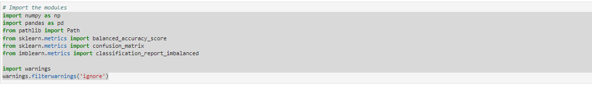
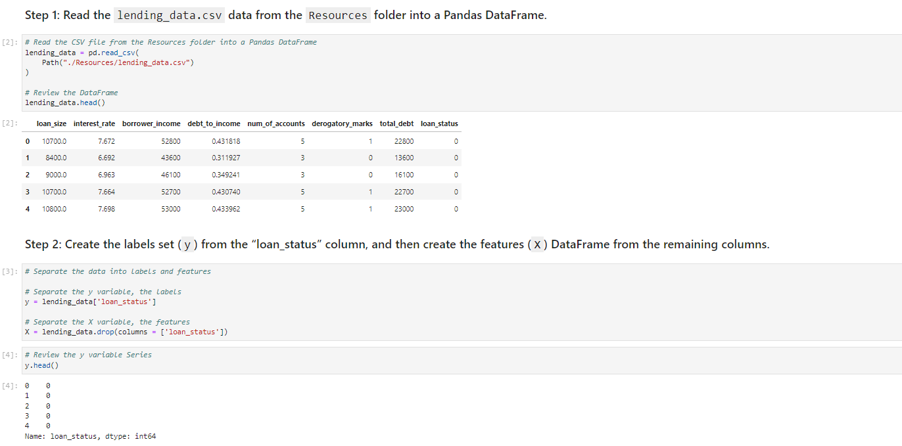
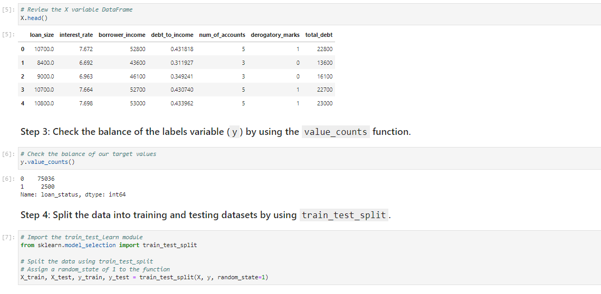
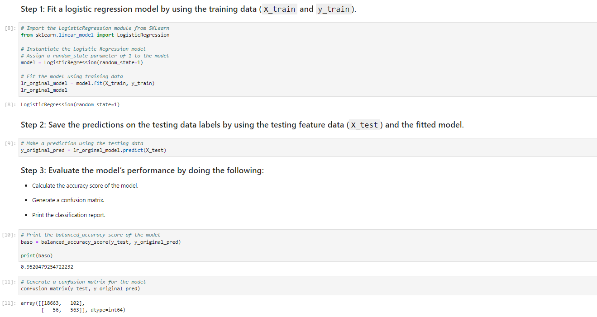
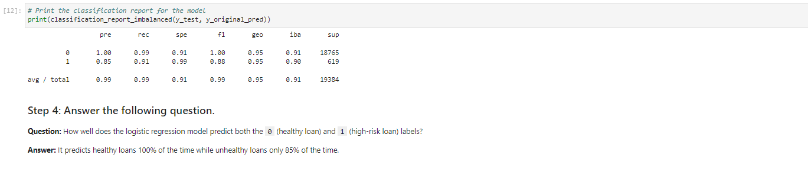
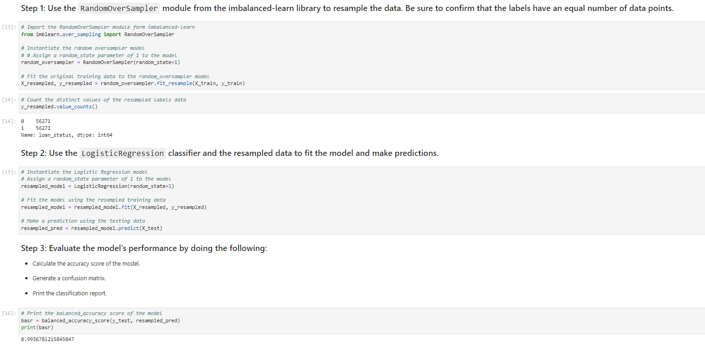
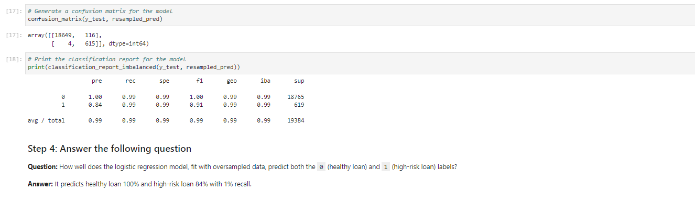

# Credit-Risk-Resampling
Use various techniques to train and evaluate models with imbalanced classes. Create a credit risk analysis report based on the info provided.

Credit risk poses a classification problem that’s inherently imbalanced. This is because healthy loans easily outnumber risky loans. In this Challenge, you’ll use various techniques to train and evaluate models with imbalanced classes. You’ll use a dataset of historical lending activity from a peer-to-peer lending services company to build a model that can identify the creditworthiness of borrowers.

The steps for this project are divided into the following sections:

1. Import the Data 
2. Split the Data into Training and Testing Sets
3. Create a Logistic Regression Model with the Original Data
4. Predict a Logistic Regression Model with Resampled Training Data
5. Write a Credit Risk Analysis Report


---

## Technologies

This project leverages Anaconda and JupyterLab with Python 3.9:

* [Anaconda](https://www.anaconda.com/products/individual) 

Need to import the following libraries and dependencies:

```
import numpy as np
import pandas as pd
from pathlib import Path
from sklearn.metrics import balanced_accuracy_score
from sklearn.metrics import confusion_matrix
from imblearn.metrics import classification_report_imbalanced

import warnings
warnings.filterwarnings('ignore')
```

---

## Installation Guide

Before running the application first install the following dependencies.

1. Install [Anaconda](https://www.anaconda.com/products/individual) from link 
2. Open up GitBash(Windows) or Terminal(Mac)
3. Type ```conda update conda``` to update Conda
4. Type ```conda update anaconda``` to update Anaconda
5. Type ```conda create -n dev python=3.9 anaconda```
6. Type ```conda activate dev``` to activate conda
7. Install a dev environment kernel by typing ```python -m ipykernel install --user --name dev```
8. Install a node environment by typing ```conda install -c conda-forge nodejs```
9. Launch JupyterLab by typing ```jupyter lab```

Open a terminal window, and then activate your ```dev``` virtual environment by running the following command:
```
conda activate dev 
```
Install imbalance-learn by running the following command:

```
conda install -c conda-forge imbalanced-learn 
```
Install PyDotPlus by running the following command:

```
conda install -c conda-forge pydotplus
```
---

## Usage

You will need to clone the repo so that you can run the application:

```
 git clone https://github.com/locthai2002/Crypto-Clustering-Machine-Learning.git
```

Here are some screenshots from running the application:

### Import the Data



### Prepare the Data



### Find the Best Value for k Using the Original Data



### Cluster Cryptocurrencies with K-means Using the Original Data



### Optimize Clusters with Principal Component Analysis



### Find the Best Value for k Using the PCA Data



### Cluster the Cryptocurrencies with K-means Using the PCA Data



### Visualize and Compare the Results


---

## Contributors

Loc Thai -- www.linkedin.com/in/loc-thai-69b8a2141
Phone: 415.400.9998

---

## License

MIT
